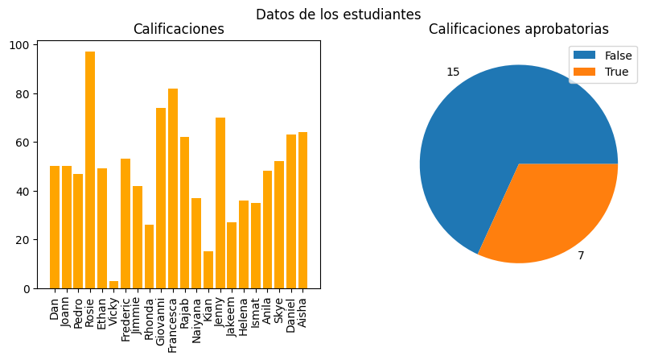
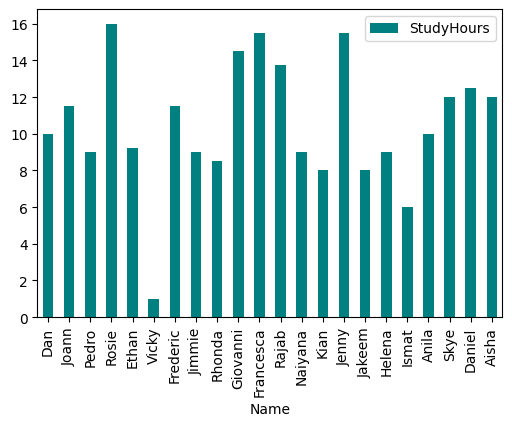
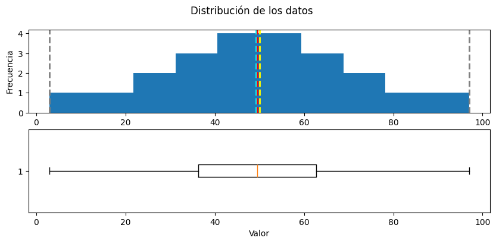
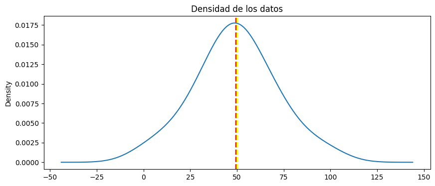

# Curso 01 - Explore and Analyze Data with Python

Curso: [Explore and analyze data with Python](https://learn.microsoft.com/training/modules/explore-analyze-data-with-python/) (Microsoft Learn) · Certificación relacionada: DP-100

## Entregables

Ver [`entregables/resumen-entregables.md`](entregables/resumen-entregables.md) para el mapeo contra lo pedido en la curva de formación.

## Notebooks

- [`notebooks/01-numpy-pandas.ipynb`](notebooks/01-numpy-pandas.ipynb) — Módulo 3 (ejercicio): exploración de arrays con NumPy y de datos tabulares con Pandas (indexado `loc`/`iloc`, carga desde CSV, valores nulos, filtrado, `groupby`).
- [`notebooks/02-matplotlib-visualizacion.ipynb`](notebooks/02-matplotlib-visualizacion.ipynb) — Módulo 5 (ejercicio): gráficos de barras/circular con Matplotlib, `Figure`/subplots, histogramas, diagramas de caja, medidas de tendencia central (media/mediana/moda) y densidad de probabilidad.
- [`notebooks/03-datos-mundo-real.ipynb`](notebooks/03-datos-mundo-real.ipynb) — Módulo 7 (ejercicio): valores atípicos por percentil, distribución sesgada, medidas de variabilidad, regla empírica, normalización (MinMax), correlación, y regresión lineal por mínimos cuadrados para predecir.

## Visualizaciones

| | |
|---|---|
|  Calificaciones + proporción aprobados/reprobados (`subplots`) |  Horas de estudio por estudiante (`df.plot.bar`) |
|  Distribución de calificaciones: histograma + diagrama de caja |  Densidad de calificaciones (curva normal) |

## Datasets

- [`datasets/grades.csv`](datasets/grades.csv) — calificaciones y horas de estudio de una clase ficticia. Fuente: [MicrosoftLearning/mslearn-ml-basics](https://github.com/MicrosoftLearning/mslearn-ml-basics).

## Apuntes técnicos

- [`apuntes/notas-tecnicas.md`](apuntes/notas-tecnicas.md) — entorno usado, decisiones de preprocesamiento y notas ligadas al código de este curso.

## Cómo ejecutar

Requiere Python 3.11 con `numpy`, `pandas`, `matplotlib`, `scipy`, `scikit-learn` e `ipykernel` instalados. Abre el notebook en VS Code (extensiones Jupyter + Python), selecciona el kernel Python 3.11 y ejecuta las celdas en orden.
