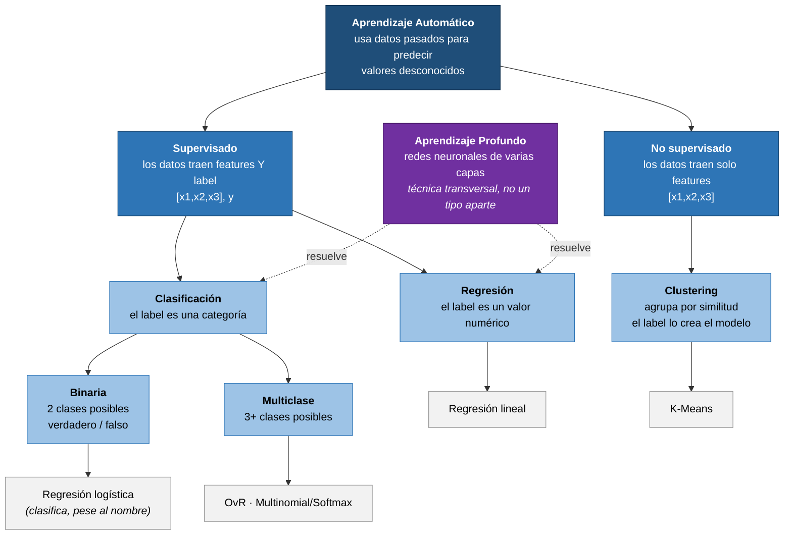

# Mapa conceptual — Tipos de Machine Learning

Curso 02 · [Fundamentals of machine learning](https://learn.microsoft.com/training/modules/fundamentals-machine-learning/)

## El mapa

## Cómo leerlo

La división de primer nivel se decide con **una sola pregunta**: ¿los datos de entrenamiento traen label o no?

- **Sí** → supervisado. Segunda pregunta: ¿qué tipo de label? Numérico → regresión. Categórico → clasificación.
- **No** → no supervisado. El clustering crea el label (el número de clúster) que antes no existía.

El **aprendizaje profundo** aparece aparte y con línea punteada a propósito: no es una cuarta rama junto a regresión/clasificación/clustering, sino una **técnica** (basada en redes neuronales) que puede resolver problemas de varias de esas ramas.

## Diferencia clave: clustering vs. clasificación multiclase

A primera vista hacen lo mismo (repartir observaciones en grupos discretos). La diferencia no está en el resultado sino en el punto de partida:

| | Clasificación multiclase | Clustering |
|---|---|---|
| ¿Se conocen las clases de antemano? | Sí, vienen en los datos de entrenamiento | No, no existe ninguna etiqueta previa |
| ¿Qué aprende el algoritmo? | La relación features → clase conocida | Agrupamientos basados solo en similitud de features |
| ¿Se puede medir "cuántas acertó"? | Sí | No — solo se mide la separación geométrica |

Ambos se pueden encadenar: primero clustering para descubrir qué grupos existen, luego bautizarlos a mano, y usar esas etiquetas para entrenar un clasificador que asigne casos nuevos.

## Qué se mide en cada rama

| Rama | Métricas de evaluación |
|---|---|
| Regresión | MAE, MSE, RMSE, R² |
| Clasificación | Matriz de confusión → exactitud, precisión, recall, F1, AUC |
| Clustering | Silueta, distancia media al centroide, inercia |

Lo que cambia entre ramas no es solo el algoritmo: es **qué se puede medir**. En clustering no hay respuesta correcta contra la cual comparar, así que lo único evaluable es la geometría del resultado.
