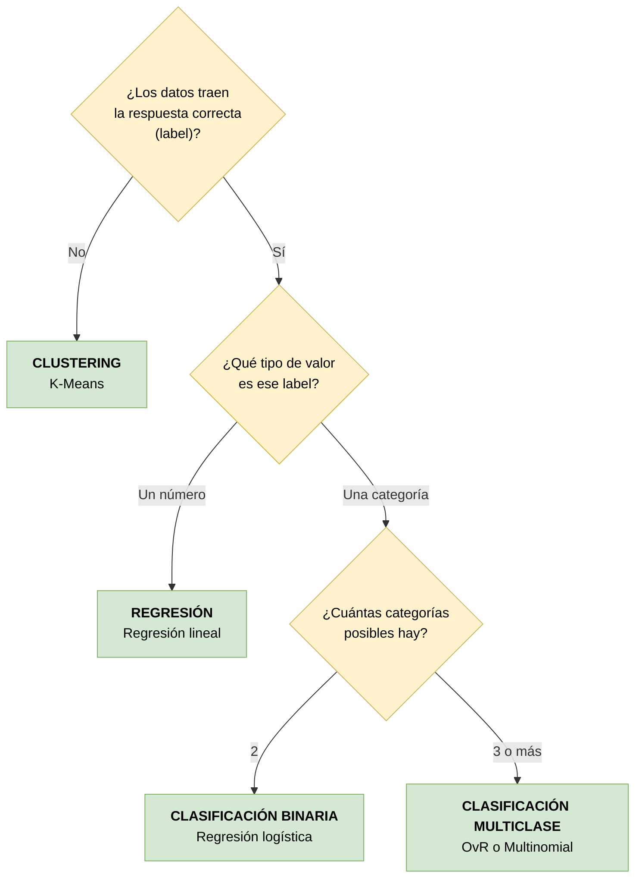

# Matriz de escenarios — Cómo seleccionar el tipo de modelo

Curso 02 · [Fundamentals of machine learning](https://learn.microsoft.com/training/modules/fundamentals-machine-learning/)

## Árbol de decisión

## Matriz de escenarios

| # | Escenario | Label a predecir | Tipo de label | **Modelo** | Métrica principal |
|---|---|---|---|---|---|
| 1 | Cuántos helados se venderán mañana según el clima | `IceCreamsSold` | Número | **Regresión** | RMSE |
| 2 | Precio de venta de una vivienda según tamaño y ubicación | `rent_amount` | Número | **Regresión** | RMSE / R² |
| 3 | Eficiencia de combustible de un auto según motor y peso | mpg | Número | **Regresión** | RMSE |
| 4 | Si un paciente está en riesgo de diabetes | `Diabetic` (0/1) | Categoría (2) | **Clasificación binaria** | Recall |
| 5 | Si un cliente incumplirá el pago de un préstamo | mora sí/no | Categoría (2) | **Clasificación binaria** | Recall / AUC |
| 6 | Si un cliente responderá a una campaña de marketing | responde sí/no | Categoría (2) | **Clasificación binaria** | Precisión |
| 7 | Especie de un pingüino según sus medidas | `Species` (0/1/2) | Categoría (3) | **Clasificación multiclase** | F1 por clase |
| 8 | Género de una película según reparto y presupuesto | género | Categoría (5+) | **Clasificación multiclase** | F1 por clase |
| 9 | Segmentar clientes por hábitos de compra | *(no hay)* | — | **Clustering** | Silueta |
| 10 | Agrupar flores parecidas por hojas y pétalos | *(no hay)* | — | **Clustering** | Silueta |

## Cómo elegir la métrica

Que dos escenarios usen el mismo tipo de modelo no significa que se evalúen igual. La métrica depende de **qué error sale más caro**:

| Situación | Métrica a priorizar | Por qué |
|---|---|---|
| Dejar pasar un caso positivo es grave (diagnóstico médico) | **Recall** | Mide cuántos positivos reales detectó. Un falso negativo = un enfermo sin tratar |
| Una falsa alarma es costosa (campaña cara por cliente contactado) | **Precisión** | Mide cuántos de los que señaló eran realmente positivos |
| Hacen falta ambas equilibradas | **F1** | Combina precisión y recall en un solo número |
| Las clases están desbalanceadas | **Nunca exactitud sola** | Con 11% de positivos, predecir siempre "no" da 89% de exactitud sin servir de nada |
| Error de regresión en unidades interpretables | **RMSE** | Está en las mismas unidades del label ("fallamos por ~5 helados"). El MSE no |
| Cuánta variación explica el modelo | **R²** | Va de 0 a 1; distingue lo que el modelo explica de la variación aleatoria |

## Señales de alarma antes de elegir

| Señal | Qué revisar |
|---|---|
| Una feature es única por fila (fecha, ID) | Descartarla: no hay nada generalizable que aprender |
| Hay columnas de texto | Codificarlas (one-hot) antes de entrenar |
| Las features están en escalas muy distintas | Escalar antes de usar algoritmos basados en distancia (K-Means, regresión logística) |
| Hay valores nulos | Decidir entre imputar (si falta poco) o descartar (si falta la observación entera) |
| El modelo da 100% de exactitud | Sospechar: ¿se coló el label entre las features? ¿se está evaluando con datos de entrenamiento? |
| Las clases están muy desbalanceadas | No confiar en la exactitud; mirar recall y precisión por clase |

## Nota sobre aprendizaje profundo

El aprendizaje profundo no aparece en el árbol de decisión porque **no es una alternativa a estas ramas, sino una forma de implementarlas**. Una red neuronal puede resolver tanto regresión como clasificación.

La decisión de usarlo o no es posterior: primero se determina qué tipo de problema es, y después qué algoritmo lo resuelve mejor. Suele reservarse para casos con muchos datos y relaciones complejas (visión por computadora, lenguaje natural), donde un modelo lineal se queda corto.
