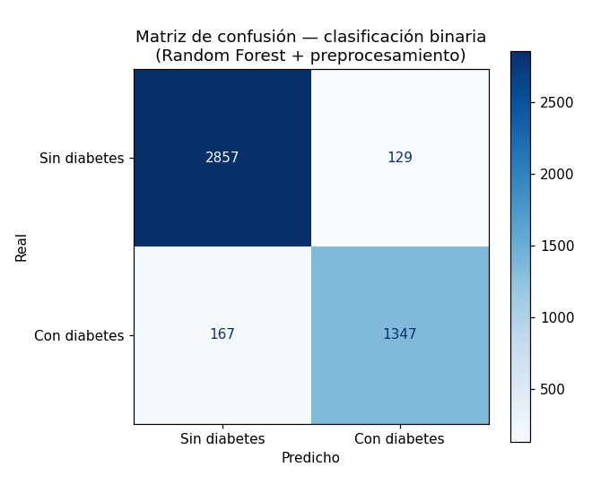
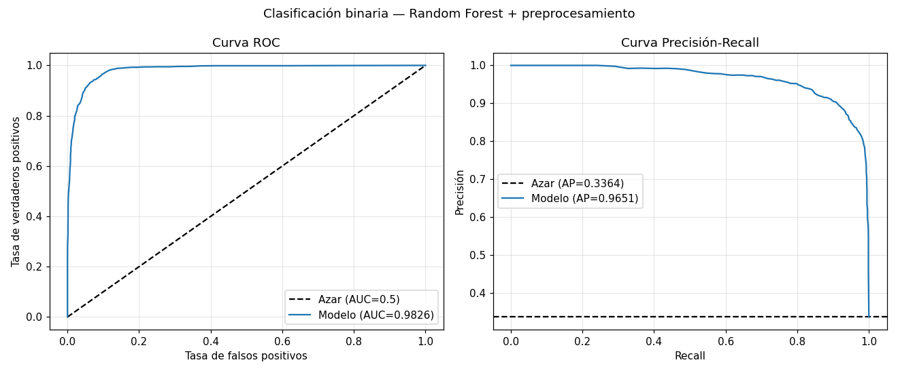
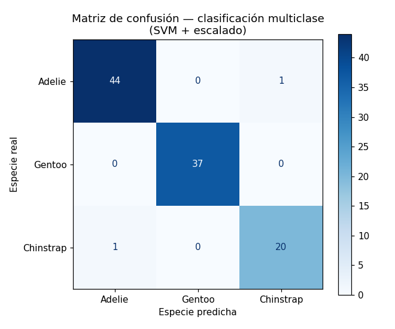
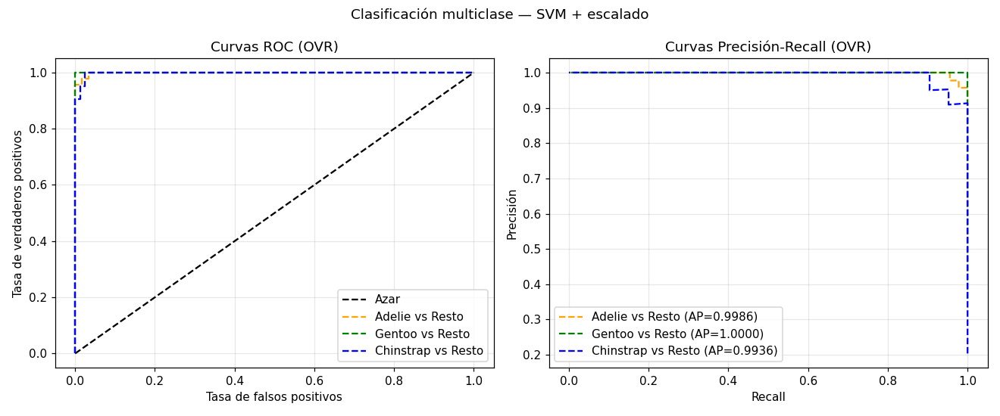

# Matriz de confusión y curvas ROC / PR

Curso 04 · Generadas a partir de los cuadernos de este curso, sobre los conjuntos de prueba reservados (30% de los datos, `random_state=0`).

---

## Clasificación binaria — diabetes

Modelo: **Random Forest + preprocesamiento** (el de mejor F1 de los tres probados). Conjunto de prueba: 4.500 pacientes.

### Matriz de confusión

| | Predicho: sin diabetes | Predicho: con diabetes |
|---|---|---|
| **Real: sin diabetes** | 2857 (TN) | 129 (FP) |
| **Real: con diabetes** | 167 (FN) | 1347 (TP) |

Lectura: de 1.514 pacientes realmente diabéticos, el modelo identificó 1.347 y se le escaparon 167. De los 1.476 que señaló como diabéticos, 129 no lo eran.

### Curvas ROC y Precisión-Recall

| | Modelo | Azar |
|---|---|---|
| **AUC** (área bajo ROC) | 0.9826 | 0.5 |
| **AP** (precisión media, área bajo PR) | 0.9651 | 0.3364 |

La línea base de la curva PR no es una diagonal sino una **horizontal** a la altura de la proporción de positivos del conjunto de prueba (33.64%).

---

## Clasificación multiclase — especies de pingüino

Modelo: **SVM + escalado**. Conjunto de prueba: 103 pingüinos de tres especies.

### Matriz de confusión

Con tres clases, la matriz crece a una celda por cada combinación de especie real y predicha. La diagonal son los aciertos.

Los pocos errores se concentran entre **Adelie** y **Chinstrap**, que es justo lo que anticipaban los diagramas de caja: ambas especies tienen perfiles parecidos en profundidad de culmen, largo de aleta y masa corporal, y solo se distinguen bien por el largo del culmen. Gentoo, en cambio, se separa con claridad de las otras dos y no se confunde.

### Curvas ROC y Precisión-Recall

Con más de dos clases **no se puede dibujar una sola curva**. Se dibuja una por clase en modo *uno frente al resto* (OVR): para cada curva, esa clase se trata como positiva y todas las demás como negativas.

AUC promedio (OVR): **0.9990**

---

## Por qué incluir también la curva PR

> La curva PR **no está en el ejercicio original** del curso, que solo cubre ROC. Se añadió porque es uno de los entregables pedidos.

No son intercambiables. La diferencia está en qué números usan:

- La **ROC** compara la tasa de verdaderos positivos contra la de falsos positivos. Esta última se calcula sobre el total de negativos reales.
- La **PR** compara precisión contra recall, y **no usa los verdaderos negativos en ningún cálculo**.

Eso importa con clases desbalanceadas: si hay muchísimos negativos, unos cuantos falsos positivos apenas mueven la tasa de falsos positivos, y la ROC puede verse optimista. La PR no tiene esa dilución y refleja mejor el comportamiento sobre la clase minoritaria.

En este dataset el desbalance es moderado (33.6% de positivos), así que ambas cuentan una historia parecida. Con un 3% de positivos la diferencia sería mucho más visible.

---

## Cómo regenerarlas

Las cuatro imágenes salen de ejecutar los cuadernos:

- Binaria → [`../notebooks/02-metricas-clasificacion.ipynb`](../notebooks/02-metricas-clasificacion.ipynb)
- Multiclase → [`../notebooks/03-clasificacion-multiclase.ipynb`](../notebooks/03-clasificacion-multiclase.ipynb)
