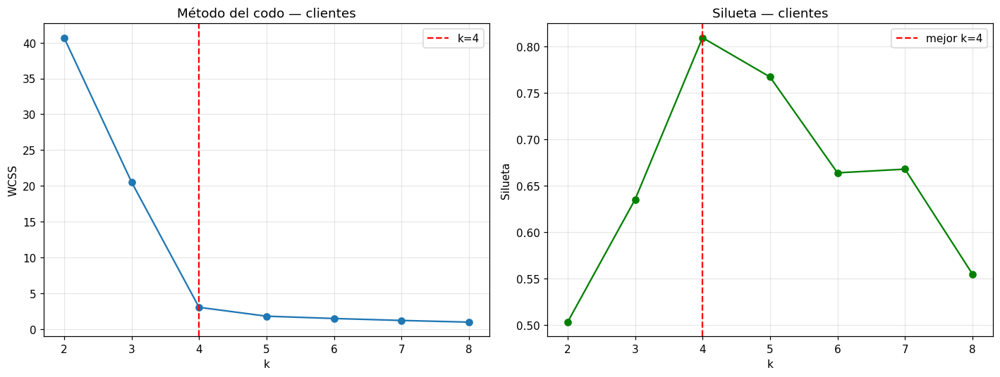
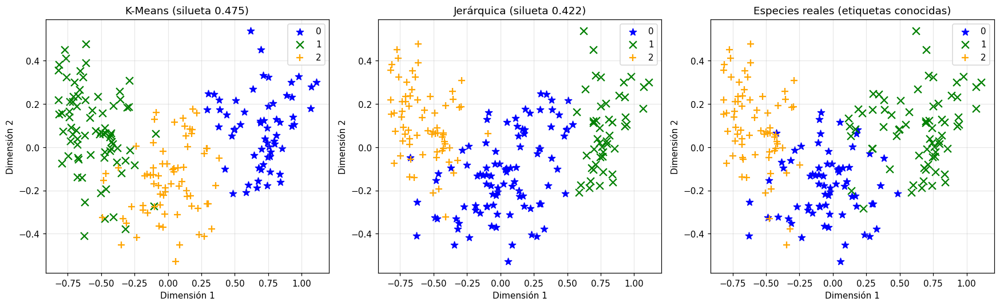

# Evaluación de clústeres con silhouette score

Curso 05 · Entregable 2

---

## Por qué hace falta una métrica distinta

En aprendizaje **supervisado** se compara lo predicho contra lo real y se cuenta cuántas acertó. En clustering **no hay respuesta correcta** contra la cual comparar: el label lo crea el propio modelo.

Lo único evaluable es la **geometría** del resultado: los puntos de un mismo grupo deberían estar cerca entre sí y lejos de los demás grupos.

## Qué es el coeficiente de silueta

Un valor entre **-1 y +1** que combina dos distancias para cada punto:

- Qué tan cerca está de los puntos de **su propio** clúster (cohesión).
- Qué tan lejos está de los puntos del clúster **más cercano** (separación).

| Valor | Interpretación |
|---|---|
| Cerca de **+1** | El punto está bien dentro de su clúster y lejos de los demás |
| Cerca de **0** | Está en la frontera entre dos clústeres |
| Negativo | Probablemente esté asignado al clúster equivocado |

El score global es el promedio de todos los puntos.

---

## Uso 1 — Elegir el número de clústeres

Entrenar con distintos valores de `k` y quedarse con el de mayor silueta.

**Clientes** (40 observaciones, 2 features):

| k | Silueta |
|---|---|
| 2 | 0.503 |
| 3 | 0.635 |
| **4** | **0.810** |
| 5 | 0.767 |
| 6 | 0.664 |
| 7 | 0.668 |
| 8 | 0.555 |

Máximo claro en **k = 4**, que coincide con el codo del WCSS.

---

## Uso 2 — Comparar algoritmos distintos

Este es el uso más interesante: con la misma `k` y los mismos datos, la silueta dice **qué algoritmo separa mejor**.

**Semillas de trigo** (210 observaciones, 6 features, k=3):

| Algoritmo | Silueta |
|---|---|
| **K-Means** | **0.475** |
| Jerárquica aglomerativa | 0.422 |

K-Means gana, aunque no por mucho. Los tres paneles muestran, de izquierda a derecha: los clústeres de K-Means, los de la jerárquica, y **las especies reales**.

### El resultado más interesante del curso

Ese tercer panel es la clave. El dataset de semillas **sí tiene** la especie de cada una (Kama, Rosa, Canadian), pero ninguno de los dos algoritmos la vio nunca.

Aun así, los grupos que encontraron **reconstruyen aproximadamente la estructura real de especies**, solo a partir de las medidas físicas. Es la demostración más concreta de para qué sirve el aprendizaje no supervisado: encontrar estructura que existe en los datos sin que nadie se la haya señalado.

---

## Una advertencia sobre la interpretación

Una silueta de 0.475 en las semillas y 0.810 en los clientes **no significa que la segmentación de clientes sea "mejor"**. Significa que esos datos están más claramente separados.

Los clientes tienen 2 features y 4 grupos muy diferenciados por construcción; las semillas tienen 6 features y variedades que se solapan de forma natural. La silueta mide la **separabilidad de los datos** tanto como la calidad del modelo.

Por eso tiene sentido comparar siluetas entre modelos aplicados **al mismo dataset**, y mucho menos entre datasets distintos.

---

## Cuadernos

- [`../notebooks/02-kmeans-y-jerarquico.ipynb`](../notebooks/02-kmeans-y-jerarquico.ipynb) — K-Means vs. jerárquica sobre las semillas, con silueta.
- [`../notebooks/03-segmentacion-clientes.ipynb`](../notebooks/03-segmentacion-clientes.ipynb) — silueta para elegir `k` en la segmentación.
