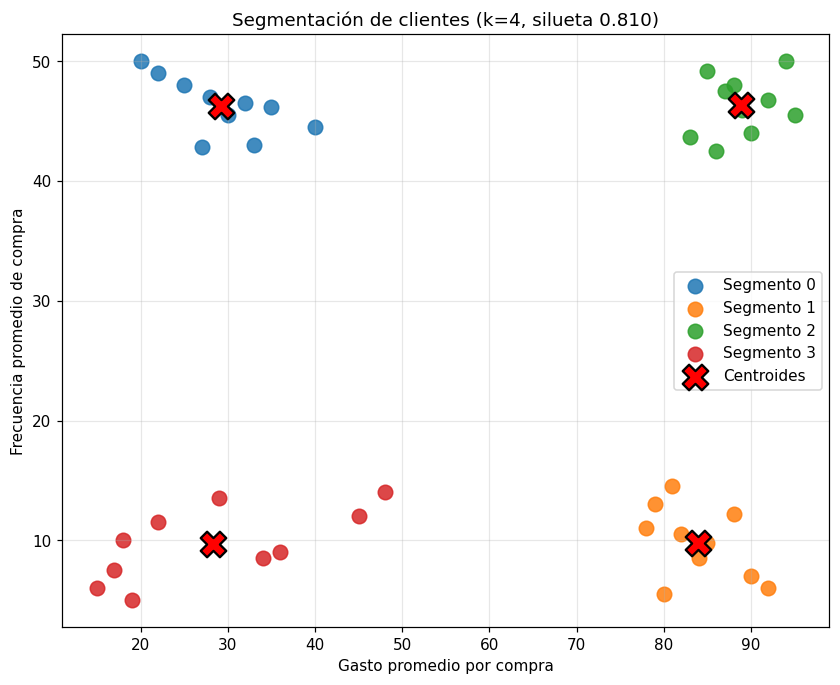

# Perfil de segmentos con recomendaciones de negocio

Curso 05 · Entregable 3

> El ejercicio original del curso usa un dataset de **semillas de trigo**, que no permite un análisis de negocio realista. Para este entregable se usa el dataset de **clientes**, que es el caso de uso que el propio curso menciona como aplicación típica del clustering: *"una organización de marketing puede querer separar a sus clientes en segmentos distintos y luego investigar cómo se comporta cada uno"*.

---

## El modelo

40 clientes, dos variables de comportamiento: **gasto promedio por compra** y **frecuencia promedio de compra**.

- Features escaladas con `StandardScaler` (K-Means se basa en distancias).
- `k = 4`, elegido por [método del codo](segmentacion-kmeans-codo.md) y confirmado por silueta.
- **Silueta = 0.810** — separación muy buena.

Los cuatro segmentos salen perfectamente balanceados (10 clientes cada uno) y forman un cuadrante limpio de gasto alto/bajo × frecuencia alta/baja.

---

## Perfil de cada segmento

Medianas de referencia de la cartera: gasto **63.00** · frecuencia **28.50**

| Segmento | Perfil | Clientes | Gasto medio | Frecuencia media | Valor estimado |
|---|---|---|---|---|---|
| **2** | **Alto valor** | 10 (25%) | 88.90 | 46.31 | **4 116.96** |
| **0** | Comprador frecuente pequeño | 10 (25%) | 29.20 | 46.25 | 1 350.50 |
| **1** | Compra grande esporádica | 10 (25%) | 83.90 | 9.80 | 822.22 |
| **3** | Bajo compromiso | 10 (25%) | 28.30 | 9.70 | 274.51 |

*Valor estimado = gasto medio × frecuencia media.*

El dato que ordena todo lo demás: entre el segmento más valioso y el menos valioso hay una diferencia de **×15**, aunque cada uno representa el mismo 25% de la cartera.

---

## Recomendaciones de negocio

La lógica es siempre la misma: **mover al cliente en el eje donde está flojo**.

### Segmento 2 — Alto valor (25% de clientes, 61% del valor estimado)

Gastan mucho y compran seguido. Es el segmento que sostiene el negocio.

- **Programa de fidelización** con beneficios tangibles.
- **Acceso anticipado** a novedades y atención preferente.
- Medir la **tasa de abandono** de este grupo por separado.

> El riesgo aquí no es que gasten poco: es **perderlos**. Un cliente de este segmento que se va cuesta lo que quince del segmento 3.

### Segmento 0 — Comprador frecuente pequeño (valor 1 350)

Vienen casi tan seguido como los de alto valor (46.25 vs 46.31) pero gastan un tercio (29.20 vs 88.90).

- **Venta cruzada** y recomendaciones de productos complementarios.
- **Paquetes** o lotes que suban el ticket medio.
- **Umbral de envío gratis** por encima de su ticket actual.

> Ya tienen el hábito de compra, que es lo difícil de construir. La palanca es el **ticket medio**. Si subieran su gasto al nivel del segmento 2, triplicarían su valor.

### Segmento 1 — Compra grande esporádica (valor 822)

Gastan casi como los de alto valor (83.90 vs 88.90) pero vienen 5 veces menos (9.80 vs 46.31).

- **Recordatorios** y campañas de recompra programada.
- **Suscripción** o pedido recurrente.
- Investigar si hay estacionalidad o si el producto tiene un ciclo de reposición largo.

> El ticket ya es bueno. La palanca es la **frecuencia**, y es el segmento con mayor margen de mejora: igualar su frecuencia al segmento 2 lo multiplicaría por cinco.

### Segmento 3 — Bajo compromiso (valor 275)

Gastan poco y vienen poco.

- **Campaña de reactivación de bajo coste**, nada de inversión alta.
- Medir la respuesta antes de destinarle más presupuesto.
- Evaluar si el coste de retenerlos justifica el retorno.

> Es el único segmento donde la recomendación válida puede ser **no invertir**. Aportan el 4% del valor estimado.

---

## Prioridad recomendada

| Prioridad | Segmento | Por qué |
|---|---|---|
| 1 | **2 — Alto valor** | Retener lo que ya funciona; es el 61% del valor |
| 2 | **1 — Compra grande esporádica** | Mayor margen de mejora (×5 potencial) con una sola palanca |
| 3 | **0 — Frecuente pequeño** | Ya tienen el hábito; subir ticket es más fácil que crear frecuencia |
| 4 | **3 — Bajo compromiso** | Solo acciones de bajo coste hasta validar que responden |

---

## Advertencias sobre esta interpretación

**Los nombres son relativos a esta cartera.** "Alto valor" significa alto *comparado con la mediana de estos 40 clientes*. Con otra base de clientes, el mismo gasto de 88.90 podría ser bajo.

**El modelo no asignó los nombres.** K-Means devolvió los números 0, 1, 2 y 3 sin ningún significado. Todo el perfilado y las recomendaciones son interpretación humana sobre la tabla de promedios — y ahí es donde está el valor de negocio del análisis.

**Dos features son pocas.** Esta segmentación solo mira gasto y frecuencia. Una segmentación real incorporaría antigüedad, categorías de producto, canal, recencia de la última compra, etc.

---

## Siguiente paso: de clustering a clasificación

Estos segmentos ya etiquetados sirven como punto de partida para un modelo **supervisado**: usando `Segmento` como label, se puede entrenar un clasificador que asigne automáticamente un cliente **nuevo** a su segmento, sin reejecutar el clustering.

Eso convierte un análisis puntual en algo operativo — y es exactamente el encadenamiento que describe el Curso 02: primero clustering para descubrir los grupos, luego clasificación para asignar casos nuevos.

---

## Cuaderno

[`../notebooks/03-segmentacion-clientes.ipynb`](../notebooks/03-segmentacion-clientes.ipynb)
