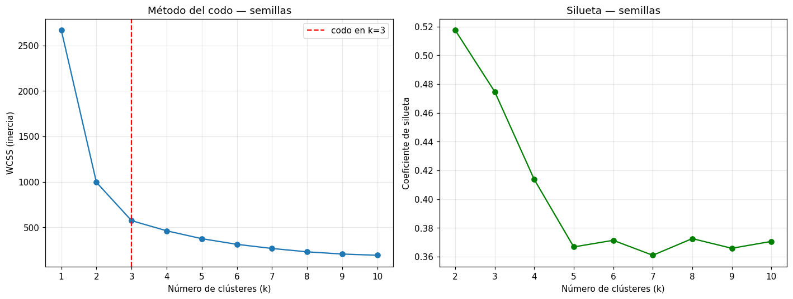

# Segmentación con K-Means y método del codo

Curso 05 · Entregable 1

El problema fundamental del clustering: sin labels conocidos, **nadie te dice en cuántos grupos dividir los datos**. El método del codo da un criterio objetivo para decidirlo.

---

## Cómo funciona el método del codo

Se entrenan varios modelos con `k` creciente y se mide el **WCSS** (*within cluster sum of squares*): la distancia acumulada de cada punto a su centroide. En scikit-learn es el atributo `inertia_`.

Al graficarlo contra `k`, se busca el punto donde la curva **deja de mejorar bruscamente** — el "codo".

> **La trampa a evitar**: el WCSS *siempre* baja al añadir clústeres. Con tantos clústeres como observaciones, sería exactamente cero. Por eso no se busca el valor mínimo, sino **dónde deja de compensar** añadir uno más.

---

## Caso 1 — Semillas de trigo

210 semillas, 6 medidas físicas cada una. Reducidas a 2 dimensiones con PCA (que conserva el **91.8%** de la varianza) para poder visualizarlas.

| k | WCSS | Caída respecto al anterior |
|---|---|---|
| 1 | 2669.4 | — |
| 2 | 995.7 | −62.7% |
| 3 | 574.5 | −42.3% |
| 4 | 462.6 | −19.5% |
| 5 | 376.0 | −18.7% |
| 6 | 313.9 | −16.5% |

La caída de 1→2 es enorme, la de 2→3 sigue siendo grande, y a partir de ahí se estabiliza en torno al 17-19%. **El codo está en k = 3.**

Es el resultado correcto: el dataset contiene efectivamente tres variedades de semilla (Kama, Rosa y Canadian), aunque el algoritmo nunca vio esa columna.

---

## Caso 2 — Segmentación de clientes

40 clientes, con gasto promedio por compra y frecuencia promedio de compra.

| k | WCSS | Silueta |
|---|---|---|
| 2 | 40.70 | 0.503 |
| 3 | 20.53 | 0.635 |
| **4** | **3.03** | **0.810** |
| 5 | 1.79 | 0.767 |
| 6 | 1.47 | 0.664 |
| 7 | 1.20 | 0.668 |
| 8 | 0.96 | 0.555 |

Aquí el codo es muy marcado: el WCSS se desploma de 20.53 a 3.03 al pasar de 3 a 4 clústeres, y después apenas se mueve. **k = 4.**

Los dos criterios coinciden —el codo y el máximo de la silueta— lo cual es la situación ideal. Cuando discrepan, hay que mirar los datos.

### Resultado de la segmentación

Cuatro segmentos de exactamente 10 clientes cada uno, que forman un cuadrante limpio de gasto alto/bajo × frecuencia alta/baja.

El perfil de negocio de cada uno está en [`perfil-segmentos-clientes.md`](perfil-segmentos-clientes.md).

---

## Buenas prácticas aplicadas

**Escalar antes de agrupar.** K-Means se basa en distancias, así que features en escalas distintas (gasto en decenas, frecuencia en unidades) distorsionan el resultado. Se usa `StandardScaler` en los clientes y `MinMaxScaler` antes del PCA en las semillas.

**Fijar `n_init` y `random_state`.** K-Means arranca con centroides en posiciones **aleatorias**, así que dos ejecuciones pueden dar resultados distintos. `n_init` hace varias pasadas completas y se queda con la de mejor WCSS; `random_state` hace que el resultado sea reproducible entre ejecuciones.

**Confirmar el codo con la silueta.** El codo a veces es ambiguo — la curva se dobla suavemente y la elección tiene algo de criterio. Contrastarlo con otra métrica da más seguridad.

---

## Cuadernos

- [`../notebooks/01-explorar-clusters.ipynb`](../notebooks/01-explorar-clusters.ipynb) — PCA y método del codo sobre las semillas.
- [`../notebooks/03-segmentacion-clientes.ipynb`](../notebooks/03-segmentacion-clientes.ipynb) — codo + silueta y segmentación de clientes.
